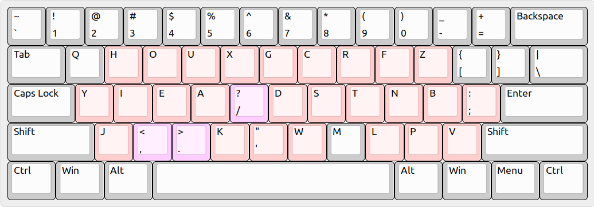

# BEAKL-15p Keyboard Layout

This is a variation of [BEAKL]-15 that emphasizes programming comfort:

* Digits and shifts are standard (shifted comma isn't an exclamation).
* Comma and period are adjacent and in standard order (comma, period).
* Slash is on the home row for easy path separation and Vim searching.

[BEAKL]: https://deskthority.net/wiki/BEAKL

## Preview

Besides digits, only 3 keys have been moved: comma, period, and slash.

See [my Ergodox EZ config](
  https://configure.ergodox-ez.com/ergodox-ez/layouts/vKBnl
) for a more advanced example of this layout.
